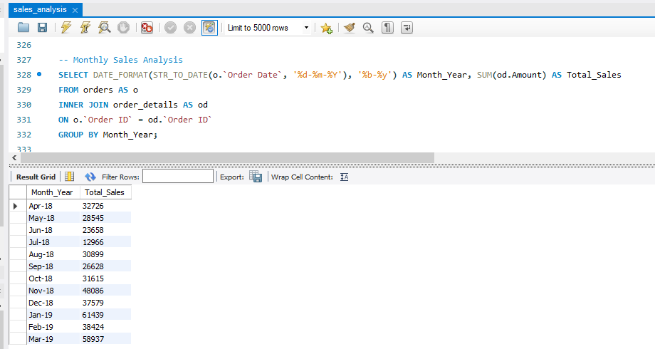
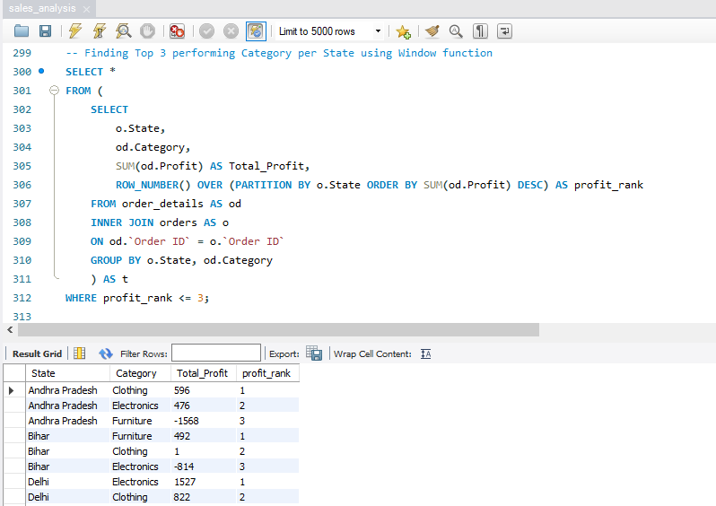
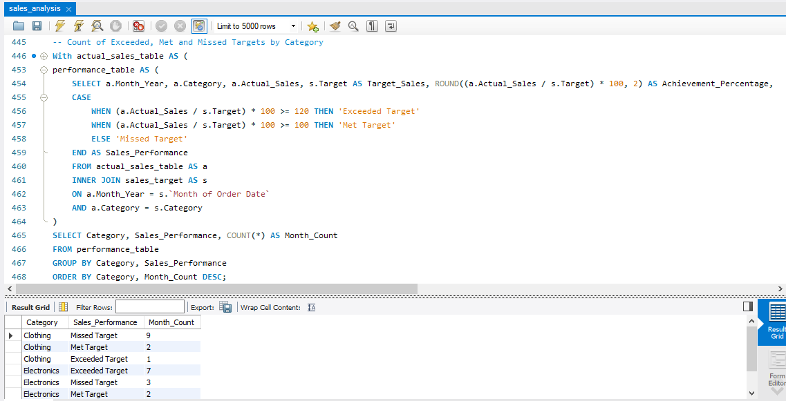
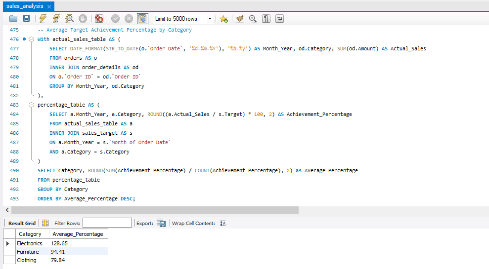

# Retail Sales SQL Analysis

## Project Overview

This project focuses on analyzing retail sales data using SQL. The goal was to move beyond basic querying and perform a complete analysis workflow, starting from data exploration and quality checks to business focused insights.

The analysis covers sales performance, profitability, customer behavior, geographic trends, time-based analysis and target vs actual sales performance. Data quality and table relationships were also validated before performing the analysis to ensure reliable results.

## Dataset

The project uses three datasets:

- List of Orders:  Contains order information such as order date, customer, city and state.
- Order Details: Contains transactional details including category, sub-category, sales amount, quantity and profit.
- Sales Target: Contains monthly sales targets by category.

## SQL Concepts Used

Throughout the project, the following SQL concepts were applied:

- Data exploration
- Data quality checks
- Data cleaning
- Joins
- Aggregate functions
- Common Table Expressions (CTEs)
- Window functions
- Date functions
- Grouping and filtering
- Business KPI calculations

## Analysis Performed

### Data Preparation
- Explored dataset structure and record counts
- Identified duplicate and incomplete records
- Removed records with missing values
- Validated relationships between tables

### Business Metrics
- Total Sales
- Total Profit
- Total Orders

### Category Analysis
- Sales and profit performance by category and sub-category

### Customer Analysis
- Customer-level profit analysis
- Identification of top-performing customers

### Geographical Analysis
- State-wise profit performance
- Identification of top-performing states

### Multi-Dimensional Analysis
- Analysis across multiple business dimensions such as category, location

### Window Function Analysis
- Ranking and comparative analysis using SQL window functions

### Time-Based Analysis
- Monthly sales analysis
- Monthly profit analysis
- Identification of top-performing months

### Target vs Actual Sales Analysis
- Comparison of actual sales against targets
- Achievement percentage calculation
- Classification of performance as Exceeded, Met or Missed Target
- Category-wise target achievement evaluation

## Project Screenshots

### Monthly Sales Analysis

### Window Function Analysis

### Target Performance Summary

### Average Target Achievement by Category

## Conclusion

This project demonstrates how SQL can be used to clean, validate and analyze business data. By combining data preparation, analytical queries, window functions and performance evaluation, the project transforms raw sales records into meaningful business insights.
